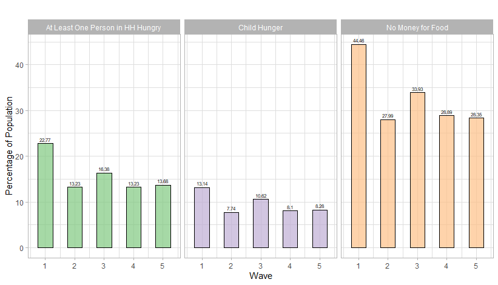
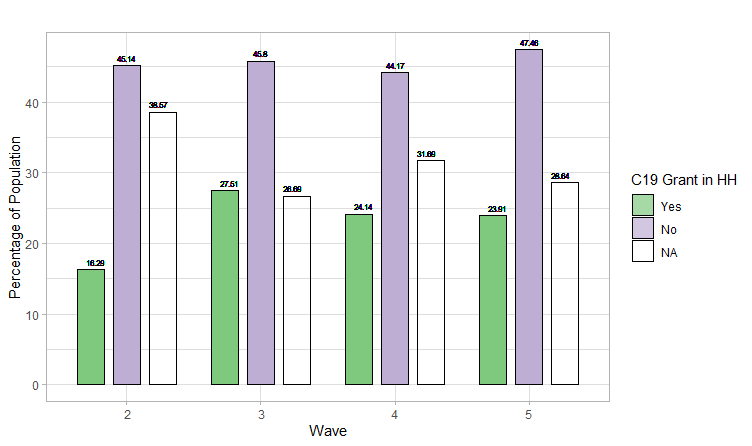

<!-- First: Set your default preferences for chunk options: -->

```{r setup, include=FALSE}
knitr::opts_chunk$set(echo = FALSE, message = FALSE, warning = FALSE, fig.width = 6, fig.height = 5, fig.pos="H", fig.pos = 'H')


if(!require("tidyverse")) install.packages("tidyverse")
library(tidyverse)


```


<!-- ############################## -->
<!-- # Start Writing here: -->
<!-- ############################## -->

# Introduction \label{Introduction}

This report attempts to apply and compare panel-data methods to investigate the effect of the Covid-19 Social Relief of Distress (SRD) grant on household reported hunger. The SRD is a conditional transfer implemented to support unemployed individuals who did not receive any other social grant or UIF (Unemployment Insurance Fund) payment during the pandemic and ensuing government-instituted lockdowns, and consisted of 6 monthly payments of R350. Applications for and distribution of the SRD transfer is managed by South African Social Security Agency (SASSA). In order to assess the effectiveness of this transfer, it is necessary to know whether it is successful in providing key social security outcomes such as food security and self-reported household hunger. The recent release of the fifth wave of the National Income Dynamics Study - Coronavirus Rapid Mobile Survey 2020 (NIDS-CRAM) dataset makes it possible to analyse this effect in a nationally representative context. Panel-data analysis, afforded by the structure of NIDS-CRAM, could prove useful in disentangling the effect of the SRD on hunger.

This study compares different static panel model specifications in estimating this effect: 1) a pooled OLS (POLS) with three varying specifications, 2) a Fixed Effects (FE) model, 3) First Differences (FD) model and 4) Random Effects (RE) Model. Throughout, the varying estimators and specifications will be discussed in terms of their ability and robustness in obtaining causal effects.^[This study attempts to build on similar exploratory analyses such as in @bridgman2020hunger and @kohler2021distribution.] Results indicate that all methods find the effect of the SRD on household hunger to be close to 0. These results are robust to replacing household hunger with other food-insecurity metrics. In terms of model comparison, however, the FE method is shown to perform the best in isolating unbiased effects. 

# Data and Descriptive Statistics \label{Data}

The analysis in this report relies on the National Income Dynamics Study - Coronavirus Rapid Mobile Survey 2020 (NIDS-CRAM) data, supplied by the Southern Africa Labour and Development Research Unit (SALDRU) from May 2020 to May 2021. NIDS-CRAM is a nationally representative longitudinal household survey spanning over five waves, conducted using Computer-Assisted Telephonic Interviews (CATI), meant to investigate the impact of the Covid-19 pandemic and subsequent national lockdown on the South African socioeconomic environment [@nids2020].^[Data is publicly available at https://www.datafirst.uct.ac.za/.] Interviewed individuals were drawn from the sample members of the fifth wave of NIDS, following a stratified sampling design. In wave 1, 7073 respondents were interviewed successfully, whilst a top-up of 1084 respondents was added to the sample in wave three due to attrition between the first and second waves. Lastly, data was collected only on the individual respondents and no attempt was made at collecting information from their respective household members, meaning that larger households are more likely to be interviewed. This sampling structure therefore only allows for individual-level analysis, although statistics can be estimated on household living conditions at an individual level, as is the endeavor of the current study.

As the purpose of this report is to estimate the effect of the SRD on household-reported hunger, there are two primary variables of importance, namely, 'hunger' - a binary variable where a value of 1 indicates that someone in the interviewed respondent's household (HH) was hungry in the last 7 days - and 'c19grant' - a binary variable where a value of 1 indicates whether the respondent lives in a household that receives at least one SRD grant. Figure \ref{hunger} below outlines the proportion of the South African population that have experienced food insecurity and hunger over the five waves of NIDS-CRAM. There seems to be downward trends in the proportion of individuals that report hunger in at least one person in their household, as well as in child hunger. It is also interesting to note that child-hunger is much lower than the reported household hunger. Lastly, and although trending downward over time, respondents report there to be no money for food in nearly 30% of households in almost all of the waves. When viewed together, the statistics on these metrics indicate that food security should be a concern for policy-makers during the Covid-19 era. That is, in essence, one of the justifications of an expansion of the social security framework to include the SRD transfer. Figure \ref{grant} below shows the take-up of this grant over time.^[The grant was not yet paid out during the first wave, which explains its absence here.] It is notable that the proportion of individuals who received the transfer, or lives with someone who receives it, has increased from 0 in wave 1 to almost 24% in wave 5. 

```{r hunger,fig.cap="\\label{hunger} Descriptive Statistics on Hunger", echo = FALSE, message = FALSE, warning = FALSE, out.width="100%", fig.height = 5, fig.pos="H"}



```

```{r grant,fig.cap="\\label{grant} Proportion of SRD Recipients", echo = FALSE, message = FALSE, warning = FALSE, out.width="100%", fig.height = 5, fig.pos="H"}



```

# Methodology \label{Meth}

As mentioned in Section \ref{Introduction}, this paper compares four static panel models with regards to their robustness in estimating the effect of the SRD on household hunger. In order to account for the complex survey design and related attrition and non-random response discussed in the previous section, panel weights are employed for panel methods, while the original NIDS cluster and strata variables were used throughout.^[This is according to the guidelines for longitudinal analysis set out in @nids2020, where panel weights excludes wave three top-up members, and is scaled to the NIDS wave 5 population. For the POLS specifications, weights include the top-up members.] The pooled OLS models - of which there are three differing specifications - attempt to control on observables by using variation between individuals to isolate causal effects, whilst assuming that unobservables are independently distributed, and constitutes the baseline specifications that the panel models are compared against.^[The more technical aspects of this section is elucidated further in @wooldridge.]

After merging the data across waves and setting the survey design according to that specified above, the models are estimated. The first, a baseline pooled OLS, regresses hunger on the primary independent variable, c19grant. However, this specification is problematic. For instance, omitted variable bias is introduced when treatment is correlated with other covariates that are not controlled for, such as, for instance, whether the household receives other grants, the size of the household, or the average HH income. Failure to control for these variables would violate the identifying assumption of OLS, as the effect of the SRD grant might be masked by these other covariates. The second POLS specification thereby include these controls - HH size, HH income and whether HHs receive grants.^[It must be remembered that the SRD transfer is only granted to those who do not receive other transfers from government or employment income. However, the c19grant variable used in this analysis incorporates whether other household members receive such a grant, thereby necessitating the inclusion of other covariates that would have been nullified -  such as household income - due to the conditional nature of the transfer.] The third POLS model includes time dummies to control for the time trend, and other covariates such as the province of residence and the respondent's race, gender, age, highest attained education level, and whether the dwelling is in a rural or urban setting, as these factors may all introduce bias through their possible correlation with SRD.^[For instance, persons who have attained higher education would be more likely to find the SRD application process easier to manage, as well as being less likely to be hungry (due to possibly being more resourceful in finding food).] All standard errors for the OLS models are clustered at the individual level due to repeated observations of the same individual across waves.

Whilst the specifications above control for some observable characteristics, it cannot control for possible selection on unobservables. For instance, it is feasible to imagine that those individuals who are more likely to become hungry due to anatomical differences, or those more likely to vocalize their hunger compared to others, are also more likely to apply for the SRD. The fact that households can move in and out of receiving a SRD grant across waves makes it possible to estimate the effect of the grant on hunger using FE estimation. However, time-persistent variables will offer no information from which to inform estimation, meaning that only the within-level variation remains. The assumptions underlying FE estimation - weak unconfoundedness, where the the error term must be uncorrelated with the observable predictors, and the same trends assumption, where the time trend may not depend on treatment status - both hold intuitively in this case. It is unlikely that time-variant unobservables can induce omitted variable bias. The third model employs a first-differencing methodology, an alternative to the demeaning process used by FE estimation. However, FD requires strict exogeneity of the regressors, and is also prone to inconsistent estimation if explanatory variables are subject to measurement error. In the NIDS-CRAM dataset, the possibility of measurement error is likely fairly high due to the telephonic interviewing procedure. Lastly, a RE model is estimated. REs are more efficient than any other specification above, given that it reports smaller standard errors. However, RE only delivers unbiased results in the case of strict exogeneity, otherwise delivering inconsistent estimates. In order to assess whether this is the case, Hausman tests are performed to compare FE and RE models. 

Finally, as an additional robustness check, models are also estimated for two other metrics of food insecurity, namely, 'household child hunger' and 'having no money for food'. After estimation, models will be compared as to the economic and statistical significance of their coefficients, as well as the likelihood of core assumptions being violated. The results of all specifications are displayed in the following section.

# Results \label{Results}

Table \ref{results} below presents the results of the three POLS models and three other static panel models considered. Results as a whole seem to indicate a negligible causal effect attributable to having at least one person in the HH that have received the SRD grant on whether anyone in the household was reported as hungry. The coefficients from the POLS models display a positive effect of the grant on household hunger where one would expect it to be negative, perhaps indicating that the POLS specifications are biased upwards due to unobservables. The effect of household income and household size is also surprisingly small, given that one would expect household income to be correlated with both SRD grants and hunger. Furthermore, the c19grant coefficient decreases when adding more controls to the first POLS model, albeit whilst also losing statistical insignificant. It is also important to note that the wave-dummy coefficients are insignificant, and also 0 in some cases. This might be due to collinearity, making the third model less attractive in isolating a causal effect. 

The FE specification - Model 4 - also produces a small coefficient value for the SRD grant, but is of the expected negative sign and is statistically significant at the 10% level. The FD model displays a lower coefficient than the previous models, whilst also not being statistically significant. Moreover, the sample size for the FD is lower than for the other models due to the unbalanced nature of the data, which, although not problematic, means that the FD model has less information to draw inference from. Lastly, the RE model coefficient is the closest to 0 out of all models, and is statistically insignificant. When comparing the FE and RE coefficients, it is important to note that they differ relatively in size, indicating that exogeneity might not hold for both models. A Hausman test, displayed in the appendix (Table \ref{hausman}), shows that one can reject the null hypothesis of exogeneity being present at a 1% level, further justifying FE to be more appropriate than RE in this context.

```{r results,fig.cap="\\label{results} Estimation Results (Own Calculations, Data: NIDS-CRAM)", echo = FALSE, message = FALSE, warning = FALSE, out.width="100%", fig.height = 2, fig.pos="H"}

knitr::include_graphics("figures/hunger_table.png")

```

It is clear that the effect of SRD on hunger is negligibly close to 0 across all specifications. These results are substantiated further when substituting out different measures for food insecurity, the results of which are displayed in the appendix \ref{appendix}. Using all three different measures, and across all models, the effect remains close to zero.^[Hausman tests for these other metrics also indicate FE to be more appropriate.] @bridgman2020hunger reports similar results, concluding that the small effect might be due to the monetary value of R350 not being sufficient to lift households above food security lines. It is also possible that individuals that receive the grant do not distribute the gains to other members of the household, thereby not reducing reported hunger in other household members.

In terms of model comparison, however, it seems as if the FE model is the most robust in approaching an unbiased effect of the SRD grant on household hunger, regardless of the food security metric. This is due to the FE identifying assumptions being the least likely to be violated, given that FE does not require strict exogeneity like the RE or FD models, whilst also accounting for selection on unobservables, which POLS cannot offer. Similarly, FE displays significant results and similar coefficient values across the differing metrics. 

# Discussion \label{Discussion}

This report compared the success of four different specifications in isolating the causal effect of the Special Relief of Distress (SRD) grant on household hunger using the longitudinal NIDS-CRAM dataset. Initial exploratory results indicate a negligible effect across all specifications, and across various food-insecurity and hunger measures. It is also shown that the FE estimation method seems to be the most robust in estimating an unbiased causal effect, as it controls for selection on unobservables, whilst its primary assumptions of common trend over time and weak unconfoundedness are less likely to be violated. There remains much scope for further analysis and checks for robustness. For instance, one could compare these results to those obtained for a similar study where the household receipt of SRD is replaced by personal receipt of the SRD. If the results from the latter estimation are economically more significant than for the prior estimation, it might give an indication on the makeup of resource distribution within households.

\newpage


# References {-}

<div id="refs"></div>

\newpage

# Appendix \label{appendix} {-}

```{r results_child,fig.cap="\\label{results_child} Table of Results - Child Hunger (Own Calculations, Data: NIDS-CRAM)", echo = FALSE, message = FALSE, warning = FALSE, out.width="100%", fig.height = 4, fig.pos="H"}

knitr::include_graphics("figures/childhunger_table.png")

```

```{r results_money,fig.cap="\\label{results_money} Table of Results - No Money For Food (Own Calculations, Data: NIDS-CRAM)", echo = FALSE, message = FALSE, warning = FALSE, out.width="100%", fig.height = 4, fig.pos="H"}

knitr::include_graphics("figures/nomoney_table.png")

```


```{r hausman,fig.cap="\\label{hausman} Hausman Test (Own Calculations, Data: NIDS-CRAM)", echo = FALSE, message = FALSE, warning = FALSE, out.width="100%", fig.height = 4, fig.pos="H"}

knitr::include_graphics("figures/hausman1.png")

```


